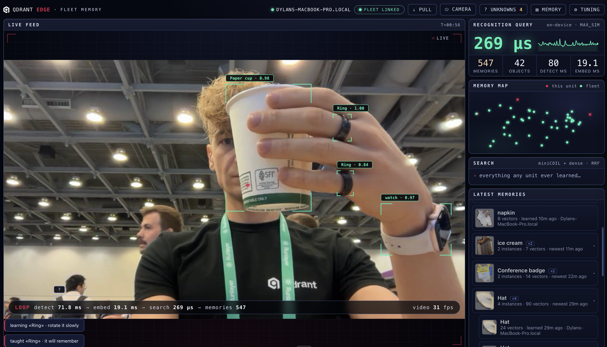

# Fleet Memory

Shared object memory on Qdrant Edge: show one device an object once, and every
device in the fleet can recognize it.

**No LLM is used at runtime.** Recognition is local vector search over shared
object memory; teaching is just adding new vectors, labels, thumbnails, and
metadata.



## What It Does

Fleet Memory lets a group of devices learn objects from each other without
training, fine-tuning, or shipping raw video around.

Teach an object by typing a name or speaking one ("this is my mug"). From then
on, every synced device can recognize that object. Ask where something was last
seen ("where did I leave my keys?") and the fleet answers from memory: which
device saw it, and when.

Each device works locally and offline. When a connection is available, devices
sync what they learned through a shared Qdrant Cloud collection. One unit
learns; all units know.

## Why Qdrant Edge

Fleet Memory runs on [Qdrant Edge](https://qdrant.tech/edge/), the embedded
build of Qdrant:

- **Local recognition:** vector search runs inside the app process against
  shards on disk.
- **Offline first:** a device can keep teaching and recognizing with no fleet
  connection.
- **Native sync:** local shards synchronize with Qdrant Cloud through
  [Edge synchronization](https://qdrant.tech/documentation/edge/edge-synchronization-guide/).

## How It Works

1. **Capture:** a webcam thread streams video at about 25 fps.
2. **Detect:** YOLOE proposes and tracks regions at about 8 Hz. Class labels are
   discarded, and people/body parts are filtered out.
3. **Embed:** stable masked crops are embedded into 512-dimensional vectors
   on-device.
4. **Match:** local Qdrant Edge shards return nearest memories. Similarity
   >= 0.80 recognizes; >= 0.55 suggests confirmation; lower is unknown.
5. **Teach:** a human names unknowns and confirms suggestions by voice or text.
   A memory is one physical thing with up to 24 views.
6. **Sync:** you choose which memories to push to the fleet, and fleet memory
   flows back to every device automatically.

| Component        | Choice                                                      |
|------------------|-------------------------------------------------------------|
| On-device search | Qdrant Edge 0.7.2, embedded shards                          |
| Fleet            | Qdrant Cloud, one shared `fleet` collection                 |
| Detector         | YOLOE-11L-seg prompt-free (ultralytics) + BoT-SORT tracking |
| Image embedding  | Unicom ViT-B/32, 512-d, via fastembed (ONNX, CPU)           |
| Text search      | miniCOIL sparse + bge-small dense, fused with RRF           |
| Speech           | whisper-base via onnx-asr (ONNX, CPU), on-device            |
| Server           | FastAPI + one WebSocket                                     |
| UI               | Vanilla JS, no build step                                   |

## Fleet Sync

Each device keeps two local shards: a writable shard for its own teachings and a
read-only mirror of the fleet collection. Recognition searches both.

- **Push:** opt-in. A teaching stays local and editable until you select it in
  curation and push it to the fleet. Nothing uploads on its own.
- **Pull:** the fleet mirror refreshes about every 30 seconds through Qdrant
  Edge synchronization.
- **Privacy:** only vectors, one thumbnail, and metadata leave the device.
  Camera frames stay local.
- **Conflict handling:** local edits win. New views taught to a downloaded
  memory override the mirror locally, then merge back on the next push.
- **Fleet sleep:** `make fleet-sleep` merges duplicate instances and archives
  stale memories using
  [Qdrant decay functions](https://qdrant.tech/documentation/search/search-relevance/).
- **Fleet ops:** an operator console at `/fleet-ops` to clean up the shared
  collection directly, renaming, merging, or deleting memories and individual
  vectors when a wrong one slips in.

## Quickstart

Requirements: macOS on Apple Silicon, or Linux with an NVIDIA GPU or CPU.
Python 3.12, [uv](https://docs.astral.sh/uv/), and a webcam.

```bash
git clone https://github.com/qdrant-labs/memory-fleet.git
cd memory-fleet
make setup
make run
```

Open `http://127.0.0.1:8765`. The first run downloads about 500 MB of model
weights. Every model loads from that local cache afterwards, so run once with a
connection, then turn Wi-Fi off and restart to confirm the offline case before a
demo.

Fleet sync is optional. Without a `.env`, the app runs fully local. To join a
fleet:

```bash
cp .env.example .env
```

Set these values:

```bash
QDRANT_URL=...        # Qdrant Cloud cluster URL
QDRANT_API_KEY=...    # Qdrant Cloud API key
DEVICE_NAME=desk-a    # this unit's fleet name
EVENT_TAG=demo        # tag stamped on pushed objects
FM_MODEL=...          # optional detector size
```

On fanless or slower Macs, set `FM_MODEL=yoloe-11m-seg-pf.pt` or
`FM_MODEL=yoloe-11s-seg-pf.pt` to reduce heat. Stored memory is unchanged.

Useful demo targets:

```bash
make run-b        # second device on port 8766 with its own data dir
make demo-scale   # build a synthetic 300k-vector shard; press S to attach it
make reset        # wipe local memory
```

## Hardware Notes

Detection is the heavy workload. The detector picks its device automatically:
CUDA if an NVIDIA GPU is present, then Apple Silicon (MPS), then CPU. Set
`FM_DEVICE=cpu` to force CPU on a shared-GPU box.

The default model follows the device: `yoloe-11l-seg-pf` on a GPU, the lighter
`yoloe-11m-seg-pf` on CPU. Override with `FM_MODEL` (for example
`yoloe-11s-seg-pf.pt` on the weakest CPU-only rigs). The model choice does not
change stored memory.

- **Minimum:** 4-core CPU, 8 GB RAM; detection rate reduced live to 2-15 Hz.
- **Recommended:** 16 GB RAM with a GPU (Apple Silicon, RTX 3060, or Jetson
  Orin NX class).
- **Cameras:** USB webcams work on macOS and Linux. Jetson CSI cameras need a
  GStreamer source and are not wired up yet.

## Applications

- Robot or drone fleets that share what they have seen without shipping raw video.
- Retail and warehouse devices learning shared inventory from any unit.
- Wearables and smart cameras that recognize objects a peer taught them.
- Edge fleets where local learning, privacy, and shared memory all matter.

## Next Step

The next scale path is two-tier memory: recognize against one compact prototype
vector per object, then keep full view sets in Qdrant Cloud for confirmation.
That moves the demo from hundreds of shared objects toward hundreds of thousands.

## Repo Layout

```text
fleetmemory/
  config.py          # .env plumbing, fleet opt-in gate
  perception/        # detector, masked crops, embedder, speech, embed cadence
  memory/            # store, matcher, labels, core
  sync/              # fleet client, sync manager, fleet-sleep job
  server/            # FastAPI app, WebSocket, capture/detect pipeline
static/              # vanilla-JS UI + brand assets
scripts/             # preload_scale.py
```
